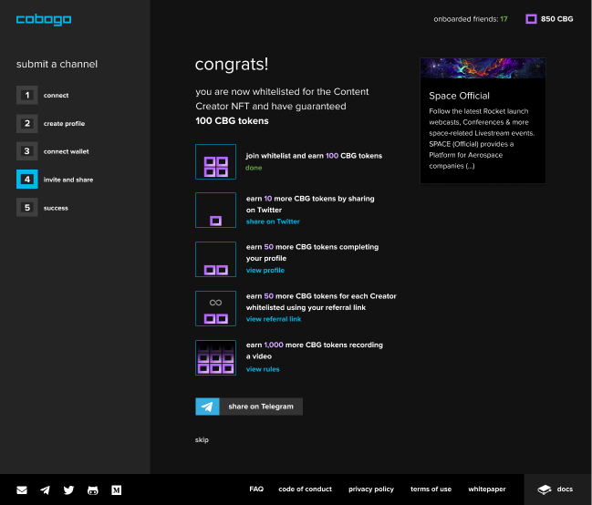

# Getting Started


#### To have your own Creator Profile, go to [https://app.cobogo.social](https://app.cobogo.social)



You can earn CBG when making your Profile and referring friends. Read more about the [referral program](broken-reference).


With cobogo, you can have your own personalized Creator Profile that shows all the relevant information about you and your services. Read more about the Creator Profiles [here](../overview/how-it-works/creator-profiles.md).

To make your Profile, you will have to go through this following onboarding process:

### Submitting a Channel

First, you will have to click on "_join now_" on the main page.&#x20;

Then, you'll have to submit your channel by connecting to your YouTube account. Your credentials and passwords will not be stored for future network authentications.

You can join cobogo even if you're not a YouTube Content Creator, you just need to have a YouTube account.

.png>)

.png>)

### Creating a Profile

After that, you will have to create your profile. In this profile, you will write a description about your channel, which will be visible to the public, defining the type of content you usually create, and any other information you think should be there.

In addition, you will have to choose a handle for your profile, and the categories your channel is inserted in, so that your profile is more easily found when fans are looking for a channel to support.

After that, hit 'next step'. Don't worry, you'll be able to change these options later, and add more information regarding your services and metrics.

### Connecting your wallet

Next, you can connect to your MetaMask Wallet. Click on the button to authenticate it.

You can skip this part if you want to.

### Inviting your friends

You have now guaranteed your **100 CBG tokens** and your **exclusive** **Content Creator NFT**!

There's a few more tasks you can do in order to earn more, and each of them are described in the list.

We give special attention to Referral Program part, where you can earn **50 more CBG for each YouTuber** that joins the whitelist using your referral link. The more friends complete the onboarding process, more CBG you and them can earn!

You can learn more about the Referral Program [here](broken-reference).

You can also earn **1,000 CBG tokens** by recording and posting a video talking about cobogo, to see more details, click [here](broken-reference).

In addition, Creators can now have their own [Creator Profile](../overview/how-it-works/creator-profiles.md), that works like a Media Kit, and 50 earn by doing that! To know how to do it, click here.

If you don't want to earn more CBG, you can click "skip".

### Success!

After whitelisting your channel, you can also join our Telegram group made especially for Content Creators.

