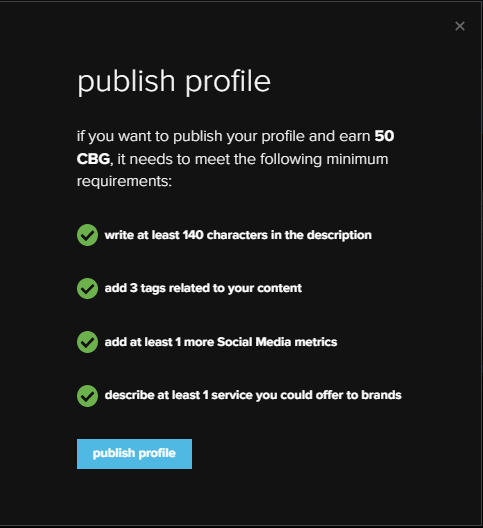

# Making your Profile

As stated in [this](../overview/how-it-works/creator-profiles.md) page, Cobogo will facilitate the work of Creators by having **all the needed information for a Media Kit in just one place**, where they can **showcase their services to high-quality clients**, in standardized **Creator Profiles**.

In this section, we will go through how to make your Profile look more **like you**, so you can attract more **potential clients**.

### Basic Information

After **connecting your channel** and onboarding cobogo, you can update the Basic Information on your profile.&#x20;

1. You can **write a description** with a minimum of 140 characters about you, your channel, or the content you usually make. We recommend being **creative**! Let people know what you are **passionate** about!
2. Then, you can link a video that you think **introduces you** the best. You don't have to record something new just for this, you can link a video that is **already up** in your channel.
3. After this, choose the **handle** for your Creator Profile. It can be the same as your YouTube channel or something new.
4. Choose the **general category** of your channel or the content you produce.
5. Then, you can expand on some **other categories** that fit you, with up to 5 tags.
6. In "website url" you can link your **preferred website** (LinkedIn, YouTube, GitHub, it's up to you!)
7. For **languages**, you can set up one or more languages your speak, or produce content in.
8. In avatar, you can choose your **Profile Picture.**
9. For the profile's banner, **1280x308** is the ideal size.

.png>)

### Social Media

After editing your basic information, you can add your social media numbers.&#x20;

At first, you'll have to add the number of followers, subscribers, average views, etc, manually, but we are working on having that updated automatically once you connect it to the social media.

You can do that to YouTube, Instagram, Twitch, TikTok, Discord, Telegram, and Twitter.

.png>)

### Analytics

You can also edit the analytics in your profile. This section allows brands to get a **quick overview** of your audience, to see if you match what they are looking for.

All you have to do is click and scroll in the **gender distribution**, **age distribution**, and **top countries** sections.

### Services

In this section, you can add the **services you can offer** to brands, just like you would in a **Media Kit**.&#x20;

We recommend using a title that **draws people's attention**, and an easily comprehensible description of what you do in that specific service.&#x20;

There's also an option to add a cover to that service, which can help making your Profile look more like you. **Be creative**!

.png>)

### Publish it

Your profile will be ready to be published! Click on "publish profile" and use it as your Media Kit!

In the future, Fans will able to stake for you in this same profile page!

