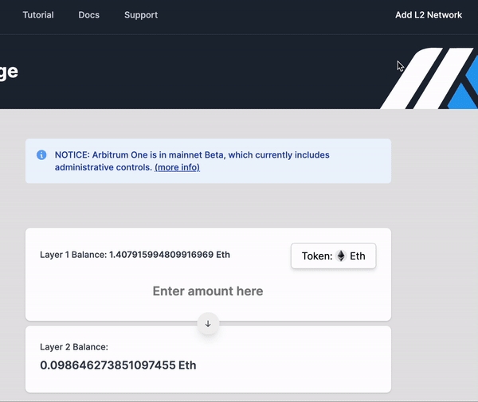

# Using Arbitrum


If you haven't used Arbitrum before, please read this section thoroughly before making any transaction.


#### Table of Contents

1. [What is Arbitrum?](using-arbitrum.md#1.-what-is-arbitrum)
2. [Why do I have to use the Arbitrum network for cobogo?](using-arbitrum.md#2.-why-do-i-have-to-use-the-arbitrum-network-for-cobogo-social)
3. [How do I add Arbitrum to my MetaMask Wallet?](using-arbitrum.md#3.-how-do-i-add-arbitrum-to-my-metamask-account)
4. [How do I transfer my DEV Tokens from the Ethereum Mainnet to Arbitrum?](using-arbitrum.md#4.-how-do-i-transfer-my-dev-tokens-from-the-ethereum-mainnet-to-arbitrum)
5. [How do I buy DEV Tokens directly on Arbitrum?](using-arbitrum.md#5.-how-do-i-buy-dev-tokens-on-arbitrum)
6. [Can I withdraw my DEV Tokens from Arbitrum to the Ethereum Mainnet?](using-arbitrum.md#6.-can-i-withdraw-my-dev-tokens-from-arbitrum-to-the-ethereum-mainnet)

### 1. What is Arbitrum?

Arbitrum bridge is a layer-2 Ethereum scaling solution, with low cost smart contracts that is able to maintain high-security standards, built by Offchain Labs, a world-class team of researchers, engineers, and Ethereum enthusiasts. It does so by facilitating transactions through off-chain means before bundling and submitting them as a single transaction to the base layer.

In sum, Arbitrum has its trustless security guaranteed by the Ethereum network; it has Ethereum Compatibility, allowing for easy deployment of Solidity and Vyper smart contracts; it solves Ethereum’s scalability issues, moving contracts’ computation and storage off the main chain, which allows for a higher throughput; and it is cost-effective, minimizing transactions costs.

### 2. Why do I have to use the Arbitrum network for cobogo?

Arbitrum is the Layer 2 system that offers the best combination of benefits, at the lowest costs. We are currently only working on Layer 2 because we want both Patrons and Creators to pay the lowest transaction fees possible when staking, withdrawing rewards, minting their tokens or any other transaction, and we believe that by doing that, more people can be motivated to join cobogo.

### 3. How do I add Arbitrum to my MetaMask Wallet?

You can do that automatically by clicking on "Add L2 Network" on Arbitrum's [website](https://bridge.arbitrum.io).&#x20;

_Note:_ for that button to appear, you need to be already logged in to your MetaMask Wallet and on Ethereum Mainnet.

You can also do that manually by going to "Add Network" and entering the following:

* Network Name: Arb1
* RPC: [https://arb1.arbitrum.io/rpc](https://arb1.arbitrum.io/rpc)
* Chain ID: 42161
* Currency Symbol: ETH
* Block Explorer URL: [https://arbiscan.io](https://arbiscan.io)

### 4. How do I transfer my DEV Tokens from the Ethereum Mainnet to Arbitrum?

To transfer your DEV tokens to Arbitrum One, you will have to use the DEV specific bridge, following the steps next:

1. Go to the [Dev Protocol Bridge](https://bridge.devprotocol.xyz/wrap).
2. Connect with your MetaMask Wallet.
3. **Wrap the amount of DEV you want to transfer and convert it to WDEV.**
4. Go to the L2 Bridge tab.
5. Enter the amount of WDEV you want to transfer and press the Convert button.

### 5. How do I buy DEV Tokens directly on Arbitrum?

There are currently two ways to buy DEV on Arbitrum.&#x20;

In the future, Binance plans on opening withdrawals to Arbitrum 2, so there will be another way for people who have funds on Centralized Exchanges.

#### Option 1

You can buy DEV Token directly from Arbitrum **if you already have funds in it**.&#x20;

You can do so by going to the direct link of Dev on [Uniswap Arbitrum](https://app.uniswap.org/#/swap?outputCurrency=0x91F5dC90979b058eBA3be6B7B7e523df7e84e137), or manually, using Dev's contract address: 0x91F5dC90979b058eBA3be6B7B7e523df7e84e137 ([Arbiscan](https://arbiscan.io/address/0x91F5dC90979b058eBA3be6B7B7e523df7e84e137)).

#### **Option 2**

**If you don't have funds in it,** you will have to move some ETH into Arbitrum, using the Arbitrum bridge ([https://bridge.arbitrum.io](https://bridge.arbitrum.io)). **** You can view Arbitrum's tutorial [here](https://arbitrum.io/bridge-tutorial/), or follow the steps next:

1. While connected to the Ethereum Mainnet, login to the [bridge](https://bridge.arbitrum.io) with your MetaMask wallet.
2. Select the token you want to bridge (ETH) in the token drop-down menu.
3. Enter the amount of ETH you want to bridge and press "deposit".&#x20;
4. Your funds will arrive in Arbitrum in about 10 minutes.
5. After your funds are in Arbitrum, you can follow the steps described in [Option 1.](using-arbitrum.md#option-1)

### 6. Can I withdraw my DEV Tokens from Arbitrum to the Ethereum Mainnet?

You withdraw DEV Tokens and any other tokens back to the Ethereum Mainnet by clicking in the arrow in the middle of the page and selecting the token in the drop-down menu.&#x20;

Then, you will have to enter the amount of DEV tokens (or other tokens) you want to bridge and press "withdraw". Follow the prompts on Metamask afterwards.

Be sure to leave enough ETH for gas fees.

Please note that there is a 7-day period until you receive your funds in the Ethereum Mainnet. Until then, you will see an unconfirmed transaction giving you a countdown for how long you have to wait until you can claim your funds.&#x20;

Once the countdown is over, switch your Wallet to the Ethereum Mainnet and press the "claim" button in that transaction.&#x20;

