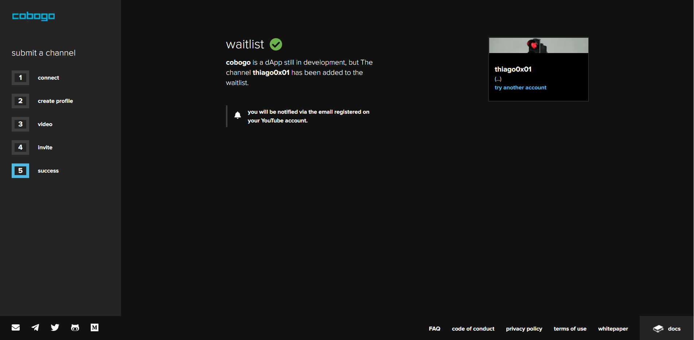

# Getting Started

To start using cobogo as a Creator, you will have to go through the following onboarding process:


Initially, our onboarding process will be destined for Content Creators wanting to join our **wait list**. These will be the first to have their tokens and pool minted once the platform is up and running.


### Submitting a Channel

First, you will have to click on "start submission" on the main page. Then, you'll have to submit your channel for analysis by connecting to your YouTube account. Your credentials and passwords will not be stored for future network authentications.

Eventually, we want to support Creators from other platforms, but initially, the wait list will be intended for YouTube Content Creators.

### Creating a Profile

After that, you will have to create your profile. In this profile, you will write a description about your channel, which will be visible to the public, defining the type of content you usually create, and any other information you think should be there.

In addition, you will have to choose a handle for your profile, and the categories your channel is inserted in, so that your profile is more easily found looking for a channel to support.

After that, hit 'send to review'. Don't worry, you'll be able to change these options later if you want to.

### Channel Analysis

Subsequently, your channel will enter a 48-hour period analysis, where the team will verify if your channel follows our rules and it doesn't have offensive content.&#x20;

We don't want to be an over-watching corporation that limits content that is not ad-friendly, but some common sense will be needed.&#x20;

After that, you will be notified via the email registered on your YouTube account if your channel was accepted or not (and why not).&#x20;

If your channel is approved, you will enter the wait list. You will also be notified once you are able to mint your own token and staking pool.

