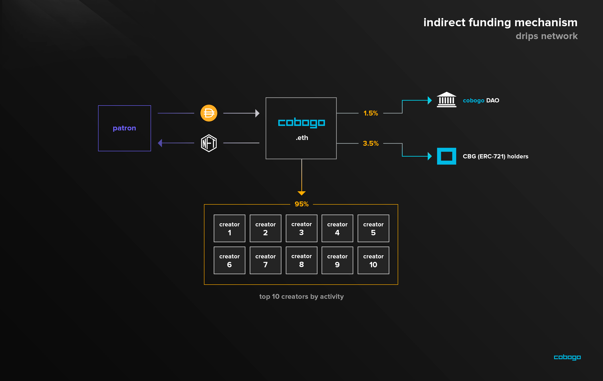
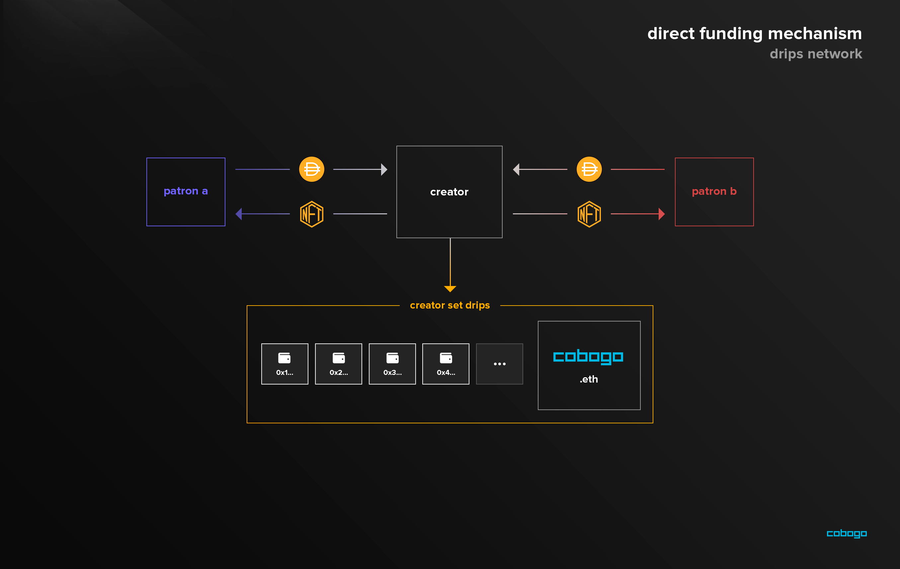

# Direct Donation

### **This potential integration is still in deliberation**

We have envisioned a reward distributing design that leverages Drips Network to fund Content Creators in the cobogo ecosystem directly by their own community members and indirectly - funding the top 10 creators - by funding cobogo itself. The proposed system could work like this:

### Indirect funding mechanism

The indirect funding mechanism is based on Patron that wants to fund Content Creators listed on cobogo and in reward they receive membership NFT that will allow them to get access to perks across the dapp - for example, [Unlock + Mintgate](gated-content.md) to provide gated content as perks.

The distribution of every donation will be split 95-5 to fit in the same scheme used on the [platform fee](../../tokenomics/token-utility/platform-fee.md) distribution. For every 100 Dai donated, 95 Dai will be dripped to the top 10 most active Creators ranked by participation on bounties/quests, gated content, social token use **and** who are dripping at least 5% of their [direct](direct-donation.md#direct-funding-mechanism) Drips to cobogo.eth **** . The remaining 5% held by cobogo will also be distributed: 1.5 Dai will go to the cobogo DAO treasury and 3.5 Dai will go to the CBG (ERC-721) holders (by the amount of CBG staked).

### Direct funding mechanism

The direct funding mechanism should be really similar to the [indirect one](direct-donation.md#indirect-funding-mechanism), but, instead of donating to cobogo, each patron could donate to his favorite Content Creator directly through their pages on cobogo and in return they would get an exclusive membership NFT that would give them access to perks, like gated content, exclusive to that specific Creator.

The creator should be able to distribute his drips however he wants it. This system is a great way to reward individuals contributing and working for the content creator, so for example, a video editor could receive an allocation of 20% of every donation.&#x20;


If a Creator wants to receive indirect funding via the Drips Network mechanism, they will have to drip at least 5% of their donations to cobogo.eth as well.&#x20;


### **Drips quickly explained**

cobogo found that the Drips system is a great fit for our vision of community building and alternative ways of funding Creators. Here is how it is described in their docs:

1 - A creator or developer chooses a funding goal and minimum supporter contribution and then creates a Community using the Drips web app at drips.radicle.network. Behind the scenes, the new Community is deployed to the Ethereum blockchain as an ERC-721 contract, which is 100% owned and controlled by the creator.

2 - Next, the creator must decide on the benefits (if any) they wish to offer to users who purchase memberships. Examples of benefits include access to gated Discord channels or the ability to participate in governance polls using Snapshot.

3 - Supporters who wish to purchase memberships and "Drip" to the creator can do so by navigating to the page for the new Community in the Drips web app and clicking "Fund". They will then be prompted to choose an amount of DAI they would like to donate and also an amount of DAI that they would like to set aside in advance to use for payment. An NFT membership badge is minted and sent to their Ethereum address. The NFT serves as both a badge of support and also a key that unlocks access to the benefits offered.

4 - Finally, the creator can choose to "spread the love" by specifying percentages of incoming funds that will be shared and dripped onwards to other users. Recipients of these drip "shares" could be contributors, charities, or other projects that they Community depends upon (e.g. a software library or other dependency).
