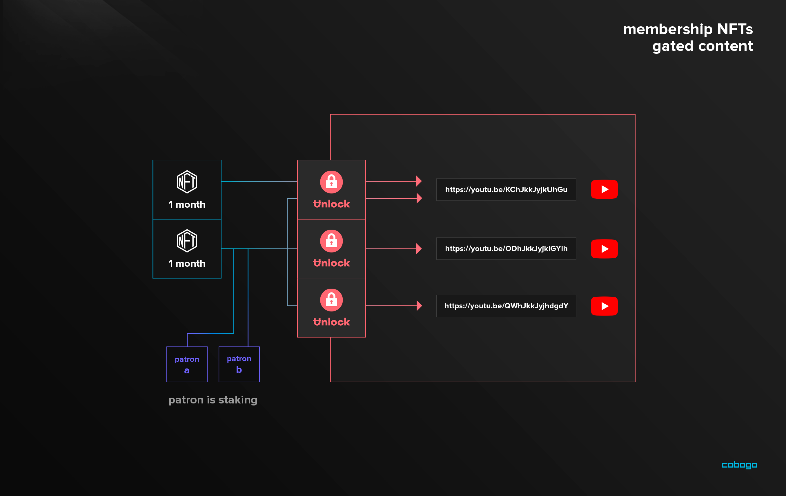

# Gated Content

cobogo designed a way to implement the Unlock Protocol + MintGate solution into our ecosystem to offer Fans, users, and CBG holders the best benefits on Gated Content that web3 has to offer.

### How does it work?

Because Unlock’s locks use the ERC-721 standard (NFT), a lock created through Unlock can be integrated with other tools that build utility for NFTs as well. This includes [Mintgate](https://www.mintgate.app/), which gives the ability to gate any link. So, when a lock is created on Unlock, it can also be used to gate links through MintGate.

This way, a Creator can set up a lock to private videos that only Fans, CFT token holders and CBG holders with a minimum amount of tokens will be able to unlock and watch.

All the Creator will have to do is name the Lock, fill in the duration, quantity, and price fields, and confirm the new lock. After that, they will use the unique identifying address to gate the link on MintGate.

If the person trying to watch the video doesn't CFT in their wallet or CBG, an image will apear announcing they don't own it, and a link to where they can purchase it to be able to watch the content.

This feature will be useful not only for exclusive YouTube videos, but also for Creators wanting to give early access to Fans and dedicated community members.

### Why is cobogo the best fit for this solution?

cobogo allows YouTubers to deploy a staking pool and Social Tokens at the same time they onboard the platform.

This means that a myriad of Content Creators and their fans will be using the Unlock + MintGate solution to access exclusive videos and have early access to content. In addition, the Social Tokens minted by cobogo are a perfect key to unlock this content, while staked CBG is the perfect master key to unlock all content in the cobogo ecosystem.

Not only that, but at the time a Fan uses the staking mechanism to fund a Creator, they receive an CBG(ERC-721) which is an NFT that proves that they are active Patrons, which can also be used as a membership badge to unlock content. That is, **with cobogo fans can unlock gated content with their staking (creator funding) position**.

Moreover, cobogo is an aggregator for funding Creators. This means that projects that can be used in parallel in our platform, like Drips Network, reward community members that donate with a membership NFT, that could also be used as a key to unlock content.

This way, cobogo offers all the solutions available in the web3 Creator Economy to maximize the use of Unlock Protocol + MintGate.
