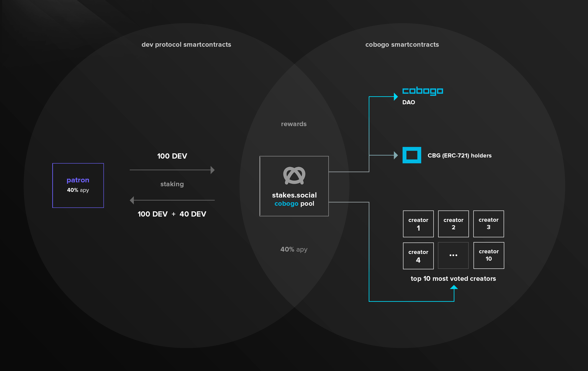

# Dev Protocol

### What it is?

[Dev Protocol](https://docs.devprotocol.xyz/en/introduction/) is a Japanese project that allows Creators to monetize their work in a sustainable way.&#x20;

They do this currently in their [stakes.social](https://stakes.social) dApp, where Open Source Software (OSS) Creators can apply their projects through the onboarding process, get their project authenticated, have their Social Tokens minted, and finally have their Staking Pool deployed, where Patrons can stake DEV Tokens on, similarly to Cobogo.

With Dev Protocol many more markets can arise, empowering communities and capturing the value of the Creator Economy.

### How does it work?

This is all possible due to the token being inflationary, which means that every year 3.15% new DEV tokens are minted and allocated to Creators and Stakers, in a 51:49 split.

By staking, both Creators and Patrons receive a yield in the form of inflationary rewards. Stakers can also hold governance rights over Dev Protocol, and for that, can have a voice in deciding tokenomics or proposing new ideas.&#x20;

### Cobogo and Dev Protocol

If DIP-55 is abolished, anyone wanting to fund YouTube Creators using DEV will be able to do so by staking for the cobogo pool on stakes.social.

Then, we will redistribute most of the accrued rewards periodically to the top YouTube Creators on our platform. This way, we will maximize the demand for the DEV token and the utility of the CBG token.

