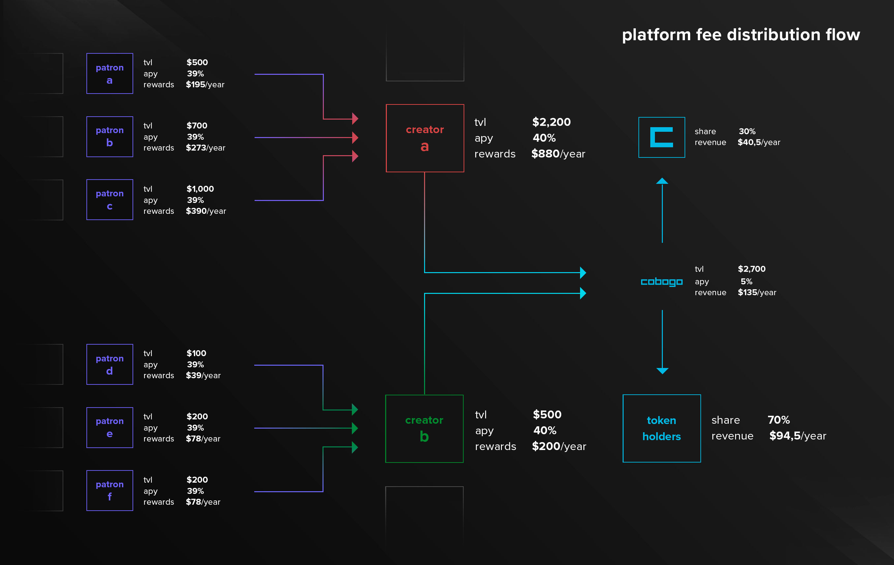

# Platform Fee

cobogo will have a fee system that will benefit active CBG token holders and the cobogo DAO.&#x20;

At the time a Patron stakes an amount of money in a Content Creator's pool, rewards will start being accrued and divided between Creators and Patrons.&#x20;

To be able to stay competitive, we will introduce a 5% fee on the rewards accrued by the Creators. Patrons APY will remain unchanged.

In the example below, the first three Patrons choose Content Creator A to support, each doing so with different amounts of money. Adding up the three values, Content Creator A will have a total of $2,200 locked in their pool. With a 40% APY, this means this Creator will get $880 in rewards in a year, if the three Patrons keep the exact amount staked initially for a year.

The same goes for Content Creator B. If Patrons 4 and 5 decide to stake for a year, this Creator will have a total value locked of $500, which means he will get $200 in rewards per year, with a 40% APY.

Out of the total value locked, which in this example means $2,700, cobogo will capture 5%. This indicates that cobogo will have a revenue of $135 a year, implying a cutback to 35% in Creator's APY. In this example, Creator A and B would then get $770 and $175 in rewards, respectively.

Regarding the $135 that would go to cobogo, we have defined that 30% ($40.50) of this will go to the cobogo DAO treasury, and 70% ($94.50) to active token holders.

This $94.50 will then be distributed as described in our [Tokenomics](../tokenomics/supply-and-distribution/).&#x20;
