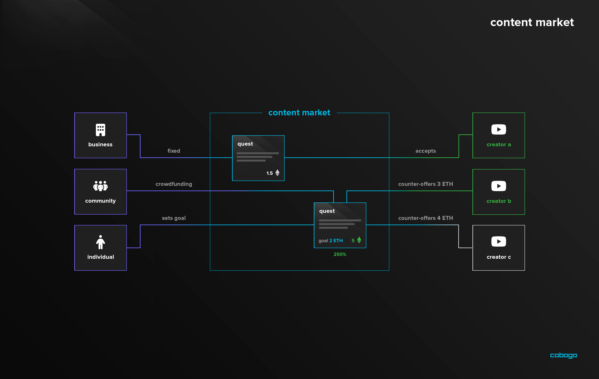

# Content Market

We have envisioned a free Content Market that will slowly be the core of the dapp, with all other funding mechanisms and integrations revolving around it. We see it not only as a way to increase the demand for the CBG but also social tokens. It will allow cobogo to collect fees and make our tokenomics sustainable.

As it is really important for our goals, we are still deliberating on the best way to create an architecture for quests in a way to create a unique market for contents. Here is how we have designed it so far:

**The goal of cobogo's Content Market is to create a market that will match Content Creators with Individuals, Communities and Companies that want to promote themselves.**

A **** quest consists of proposals that describe a certain Content that a Business, Communities or Individuals want to see created. They could offer a fixed value or could be a crowdfunding type of contract, where they would add as many funds as they want, and vote proportionally to approve the quest if a creator creates a content for them.

Creators could make counter-offers and compete between themselves to offer the best content at the best prices for cobogo users. These Creators can be incredibly hard to reach, and requesters hard to trust. So by creating this market aggregator where they could compete for quests to create content could be valuable and benefit both parties, a win-win type of solution.

This is the first service that we plan to implement on cobogo. Our vision is to use the reward splitting funding mechanism not as an end on itself but as a way to attract as many content creators as possible.&#x20;
