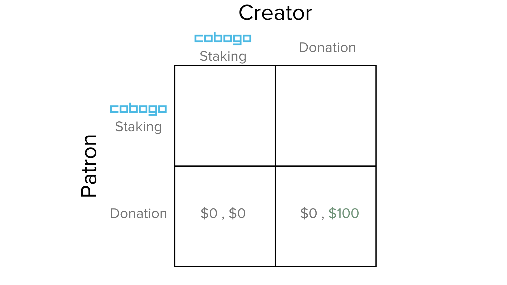
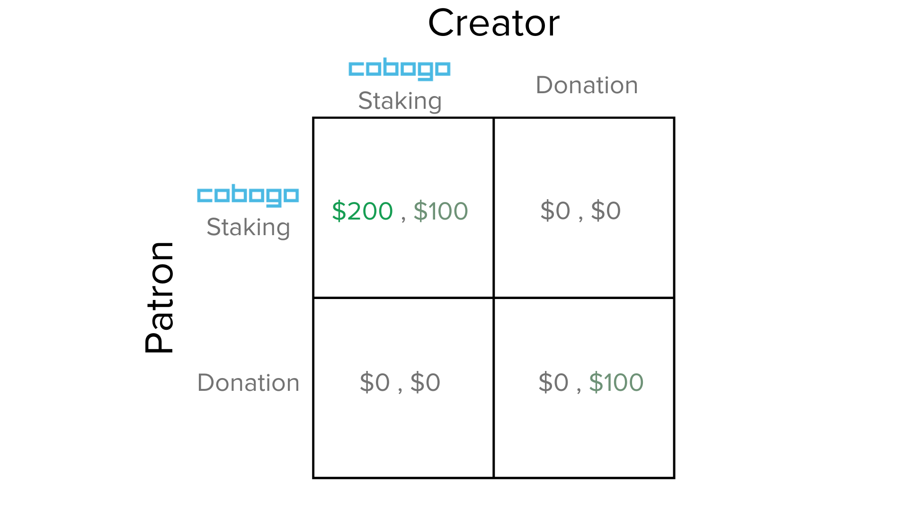

# Rewards

As described on the [Token Emission](supply-and-distribution/token-emission.md) Section, the Rewards are the incentives cobogo has designed for Patrons to fund their favorite Creators while also being rewarded for it. It is a win-win mechanism for both Patrons and Creators.&#x20;

### 1. Game Theory

Let us introduce you, through a simple Game Theory example, the incentives that cobogo creates that makes it, for some people, a superior option to sustainably fund Content Creators.

To show each particular incentive and differentiate them, let us show you a model: this will be a static game, prices are constant and the players can only choose to either use cobogo or Donate.&#x20;

Just to be clear, in real life, when you join cobogo, you're not required to give up on donations, in fact as a funding aggregator we encourage individuals to choose the best way for them to fund their favorite Creator.

#### 1.1. The Game

Suppose there are 2 players, one is the Creator and the other is the Patron. The latter dedicates $100 of his monthly income to donate to his favorite Open Source Software Creator. Financially the amount he donates gives him a **-** **$100** payoff, but, let's say that the satisfaction of donating to his favorite project is equivalent to him to a **+$100** payoff. The net payoff for him would be **$0**.

Now consider that a Creator has his project pool on cobogo and only accepts CBG. In this case, the potential Patron who either did not afford to be altruistic or did not get the sufficient satisfaction from being altruistic to justify a donation might get the incentive to fund that project.

Let's say that the Patron stakes the sufficient amount of CBG tokens that the Monthly Yield equals $100. In this case he gets both the **+$100** from the staking rewards AND the equivalent of **+$100** from the satisfaction of donating for his favorite project.

So in this game, both strategies **cobogo staking:cobogo staking** and **Donation:Donation** are Nash Equilibria. But, when the Patron deviates his strategy to cobogo staking he has a better payoff, making it the **dominant, and** **optimal** **strategy**.

### 2. Detailing the Rewards

In our split funding mechanism both Patrons and Creators get a yield that come from the token emission, the treasury and platform fees.

The rewards are inversely proportional to the staking ratio, that is, the lower the amount of CBG staked in relation to the total CBG circulating supply, the higher the Reward is, and vice-versa.

