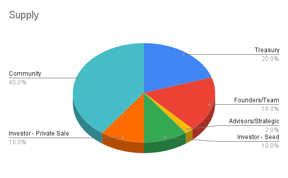

# Supply and Distribution

The Cobogo Token (CBG) is an utility token that exists to add incentives to Patrons and Creators who are willing to use the cobogo social dApp, either by having their own Creator’s pool or by staking in other Creators’ pools. The Cobogo Token will be used for capturing fees and for governance, which will allow holders to vote for upgrades. The token will be allocated in rounds into public and private sales, founders, seed, treasury, strategic YouTubers, airdrops and bounties, as follows:

The term "Community" refers to all of the CBG tokens that will be open for community members to aquire. Here's how this 40% (40,000,000 CBGs) will be distributed among bounties, airdrops, liquidity mining, liquidity, as well as the public sale:

We'll explain now what each term is about. Check the Table of Contents for quick access.

#### Table of Contents

1. [Circulating Supply](supply-and-distribution.md#circulating-supply)
2. [Treasury](supply-and-distribution.md#treasury-20)
3. [Founders/Team](supply-and-distribution.md#founders-team-18)
4. [Seed](supply-and-distribution.md#seed-10)
5. [Private Sale](supply-and-distribution.md#private-sale-10)
6. [Strategic Creators](supply-and-distribution.md#strategic-creators-2)
7. [Community](supply-and-distribution.md#community-40)
   * [Public Sale](supply-and-distribution.md#public-sale-16)
   * [Liquidity Mining](supply-and-distribution.md#liquidity-mining-12)
   * [Bounties](supply-and-distribution.md#bounties-8)
   * [Liquidity](supply-and-distribution.md#liquidity-2)
   * [Airdrops](supply-and-distribution.md#airdrops-2)

### Circulating Supply

The current circulating supply is 30,000,000, with a maximum total supply of 100,000,000. All the token allocations will enter the market asynchronously over 48 months, and some of them will be locked in for a year before doing so.

### Treasury (20%)

20% of the supply of the CBG token will be held by the DAO Treasury. This treasury will keep expanding, as long as new Content Creators onboard the platform. 5% of the Social Tokens minted when Creators onboard cobogo will go to the DAO Treasury.&#x20;

The community will decide strategically what to do with the Treasury in the [cobogo DAO](broken-reference) by vote, including partnerships, liquidity programs, and more.

This amount will remain locked for the first 12 months.

### Founders/Team (18%)

The Cobogo team and founders will receive a total of 18,000,000 CBG tokens. However, this amount will be locked for the first 12 months, and will be distributed in its entirety along the next 36 months, following this graph:

It is worth noting that there will be an internal policy to determine whether a team member should get an amount of CBG, that will specially consider the time working in the team.

### Seed (10%)

A total of 10%, which is equivalent to 10,000,000 CBG tokens will be destined to the first round of investments. This sale will be used to raise funds for the development of cobogo, and it is scheduled to start in January 2022 and end in March, 2022.&#x20;

The CBG token will cost investors $0.08, so we expect to raise $800,000 for cobogo, which also means that this will be the best buying opportunity for CBG. The tokens acquired will not be locked, but will be distributed along 12 months.

### Private Sale (10%)

Another 10,000,000 CBG tokens will be sold to investors starting in March, 2022 and ending in June, 2022, at a cost of $0.24. This time, there will also be no locked period, but the tokens will be distributed along 36 months.

The funds raised will be used for the development of cobogo as well, including hiring more people for the team and marketing.

### Strategic Creators (2%)

2,000,000 CBG tokens will be destined for a small amount of strategic YouTubers, who will be able to test the platform and advocate for it, as well as announce cobogo to their audiences. These tokens will be locked for a year, and will be distributed along the next 36 months after the locking period.

### Community (40%)

#### Public Sale (16%)

The amount of 16,000,000 CBG tokens will be destined for public sales, which means that anyone in the commuity will be able to buy CBG tokens in a decentralized exchange or any other platform available.&#x20;

This is scheduled to happen in January 2023, and the token will be at a price of $0.48. At this point in time, there will be 36,000,000 CBG tokens circulating. We expect to start a marketing campaign announcing the start of CBG sale in October 2022.

#### Liquidity Mining (12%)

12,000,000 CBG tokens will be distributed to those who provide liquidity to CBG, in a liquidity program. The more liquidity someone provides, and for longer, the greater share of the CBG pool they will receive.

#### Bounties and Quests (8%)

The amount of 8,000,000 CBG tokens will be directed towards bounties, which refer to the rewards YouTuber Creators who invite other Creators can earn.&#x20;

This distribution will happen over 3 phases. In the first one, which will happen in March 2022, 2.5% tokens, equivalent to 2,500,000 CBG will be assigned. In this first phase, each invited Creator will get 200 CBG, while the one who referred to cobogo will get 100 CBG.&#x20;

Followed by phase 2, in June 2022, 1.5% (1,500,000 CBGs) will be distributed, except that this time, the invited Creator will get 100 CBG and the one who referred, 50 CBG.&#x20;

In phase 3, happening in September 2022, 1.0% (1,000,000 CBG) of CBG tokens will be assigned, being 50 for the invited Creator and 20 for the Creator who invited them. All of the tokens will be locked for a year.

In addition, 3% of CBG, equivalent to 3,000,000 CBG, will be destined to Quests, and will be distributed among those community members who complete them. More details about these Quests will be defined in the future.

#### Liquidity (2%)

After the Public Sales happen, cobogo will provide liquidity initially with the amount of 2,000,000 CBG tokens.

#### Airdrops (2%)

We'll dedicate 2,000,000 CBG tokens to community members who promote cobogo and engage with other community members, as well as early adopters of the platform. Specific criteria for these airdrops will be defined in the future.

