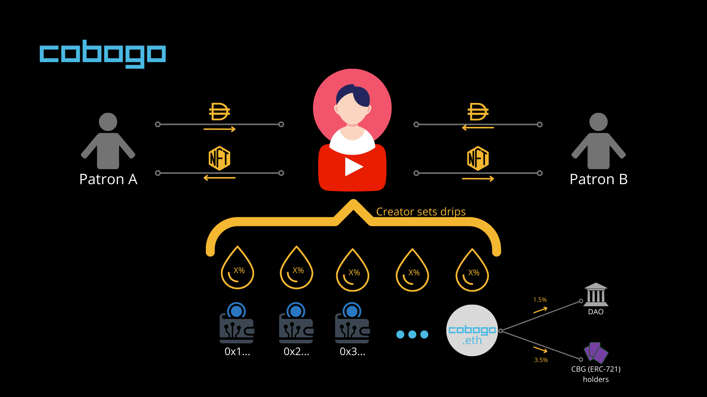

# Token Emission

cobogo has designed a Token Emission system that will allow Creators to be sustainably funded by their own community in a mutually beneficial way. The token emission will provide the rewards for staking positions, this way, the staking APY will be an incentive for individuals to stake CBG tokens to fund their favorite Creator and be rewarded for it at the same time.

The token emission formula is straightforward, the current Total Supply .png>) is equal to the Total Supply at the previous period of time .png>) plus the current Reward .png>).

.png>)

The Reward (further explained here) is inversely proportional to the staking ratio, that is, the lower the amount of CBG staked in relation to the total CBG circulating supply, the higher the Reward is, and vice-versa.

On the chart above, each of the 100 curves represents a staking ratio and the accrued rewards over time compared to the total supply. The curves are stacked from 100% to 1%, from the bottom to the top, respectively.&#x20;

The model for the Rewards caps the rewards at 10% per year, so at each period of time the emission will be contained inside a 0%-10% emission band, this way we prevent the supply from being explosive. It is expected that the staking ratio at the beginning stays between 20% to 30% which would be equivalent to approximately a 3.5% to 5.1% supply increase. The more we roll out perks and benefits to stakers we expect the supply growth to be even lower than that.


We have also designed a burning mechanism, in case the platform growth is lower than the total emission rate in a specific time frame (yearly, for example), the total reward emission  could be burned by the treasury.


