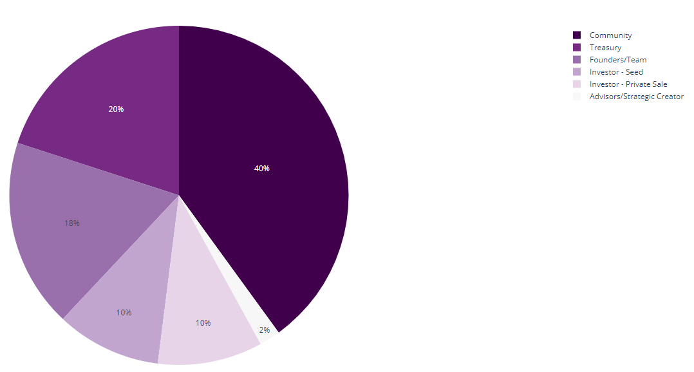
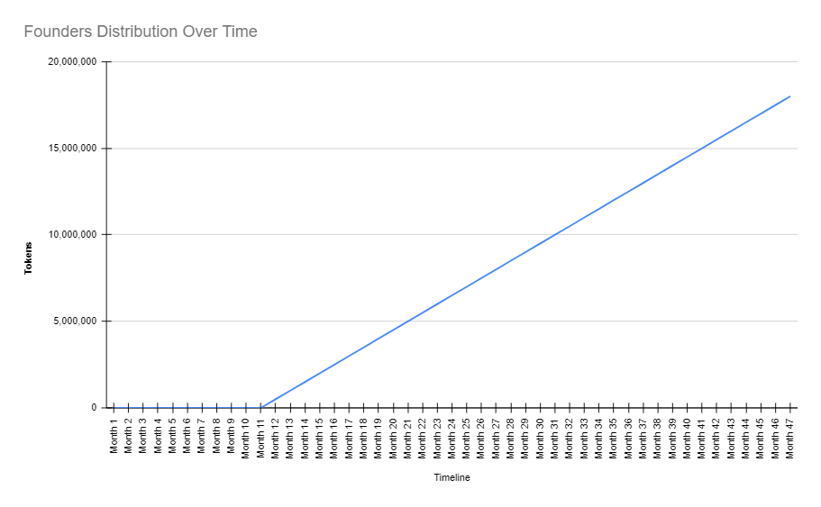

# Supply and Distribution

The Cobogo Token (CBG) is an utility token that exists so Fans can stake on their favorite Creators, and they both get rewards in the form of a yield. This way, the rewards act as incentives to Fans and Creators who are willing to use the cobogo platform, either by having their own Creator’s pool or by staking in other Creators’ pools.

The Cobogo Token will be used for staking, capturing fees and for governance, which will allow holders to vote for upgrades. The token will be allocated in rounds into public and private sales, founders, seed, treasury, strategic YouTubers, airdrops and bounties.

We'll explain now what each term is about. Check the Table of Contents for quick access.

#### Table of Contents

1. [Supply](./#circulating-supply)
2. [Treasury](./#treasury-20)
3. [Founders/Team](./#founders-team-18)
4. [Pre-Seed](./#seed-10)
5. [Private Sale](./#private-sale-10)
6. [Strategic Creators](./#strategic-creators-2)
7. [Community](./#community-40)
   * [Public Sale](./#public-sale-16)
   * [Liquidity Mining](./#liquidity-mining-12)
   * [Bounties](./#bounties-8)
   * [Liquidity](./#liquidity-2)
   * [Airdrops](./#airdrops-2)

### Supply

The maximum total supply will start at 100,000,000 CBG, and it can slowly increase every year as described in [this section](../token-emission.md).

### Treasury (20%)

20% of the supply of the CBG token will be held by the [DAO Treasury](../dao-treasury.md). The CBG treasury will be used as a mechanism to increase the APY in case the staking ratio is too high, and to burn tokens in case the staking ratio is too low for a prolonged period of time. It can also be used to create more Liquidity incentives in case it is needed.

The community will decide strategically what to do with the Treasury in the [cobogo DAO](../broken-reference/) by vote, including partnerships, liquidity programs, and more.

This amount will remain locked for the first 12 months.

### Founders/Team (18%)

The Cobogo team and founders will receive a total of 18,000,000 CBG tokens. However, this amount will be locked for the first 12 months, and will be distributed in its entirety along the next 36 months, following this distribution chart:

It is worth noting that there will be an internal policy to determine whether a team member should get an amount of CBG, that will specially consider the time working in the team.

### Pre-Seed (10%)

A total of 10%, which is equivalent to 10,000,000 CBG tokens will be destined to the first round of investments. This sale will be used to raise funds for the development of cobogo.

This will be the best opportunity for investors. The tokens acquired will not be locked, but will be distributed along 12 months.

### Private Sale (10%)

Another 10,000,000 CBG tokens will be sold to investors. This time, there will also be no locked period, but the tokens will be distributed along 36 months.

The funds raised will be used for the development of cobogo as well.

### Strategic Creators (2%)

2,000,000 CBG tokens will be destined for a small amount of strategic YouTubers, who will be able to test the platform and advocate for it, as well as announce cobogo to their audiences. These tokens will be locked for a year, and will be distributed along the next 36 months after the locking period.

### Community (40%)

#### Public Sale (16%)

The amount of 16,000,000 CBG tokens will be destined for public sales, which means that anyone in the community will be able to buy CBG tokens in a decentralized exchange or any other platform available.

At this point in time, there will be 36,000,000 CBG tokens circulating.

#### Liquidity Mining (12%)

12,000,000 CBG tokens are allocated to be distributed to those who provide liquidity to CBG, in liquidity programs. The more liquidity someone provides, and for longer, the greater share of the CBG pool they will receive.

This share of the total supply will be used as an incentive for liquidity providers, as a way to counterbalance impermanent loss caused by liquidity providing risks and volatility.

#### Bounties and Quests (8%)

The amount of 8,000,000 CBG tokens will be directed towards [bounties](../../growth-strategies/bounties.md).

Their goal is to promote cobogo’s growth, it will also work as a way to distribute CBG to active members in the community by creating incentives for individuals to perform tasks that promote cobogo’s growth. The Referral Program will be the main growth inducing program, designed so that individuals who invite Creators to the cobogo will earn CBG as a commission.

* **Referral Program**:&#x20;

In the cobogo’s Referral Program, each Creator that joins and completes the whitelisting process will receive 100 CBG. For each Creator invited to the platform with a referral code, the inviter will receive 50 CBG.&#x20;

In addition, 3% of CBG, equivalent to 3,000,000 CBG, will be destined to Quests, and will be distributed among those who complete them. In the referral program, a few Quests will be introduced as incentives and growth hacks. More details about these Quests will be defined in the future.

#### Liquidity (2%)

After the Public Sales, cobogo can provide initial liquidity to form strategic pairs, 2,000,000 CBG tokens will be allocated to this. Some investors might want to provide liquidity as a part of the deal of joining one of our investment rounds.&#x20;

As this is dependent on future developments, it will be further explained in the future.

#### Airdrops (2%)

We'll dedicate 2,000,000 CBG tokens to community members who promote cobogo and engage with other community members, as well as early adopters of the platform.

Claiming will depend on certain tasks to be accomplished.

Specific criteria for these airdrops will be defined in the future.

