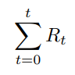

# Token Emission

Cobogo’s token emission is what allows Content Creators to be monetized directly by their fans and token holders to promote the growth of the ecosystem. 

By designing it to be inversely proportional to the amount of tokens staked, we reward first-movers and will find optimal staking equilibria as the ecosystem grows and platform progresses. 

The token emission will provide the yield for staking positions. This way, the staking APY will be an incentive for individuals to stake CBG tokens to fund the Creator they want and be rewarded for it at the same time.

The token emission formula is straightforward, the current Total Supply  is equal to the Total Supply at the previous period of time  plus the current Reward .

.png>)

The Reward (further explained [here](rewards/)) is inversely proportional to the staking ratio, that is, the lower the amount of CBG staked in relation to the total CBG circulating supply, the higher the Reward is, and vice-versa.

On the chart above, each of the lines represent a staking ratio and the growth of the total supply caused by the accrued rewards over time. The lines are stacked from 100% to 0%, from the bottom to the top, respectively. 

In previous models and models used by other crypto projects, at lower staking ratios, as the ratio approaches 0, the emission is explosive, and it could tend to be infinite. As can be noticed, in our model the amount of tokens emitted grow at lower staking ratios but they are not explosive.

The model for the Rewards caps the rewards at 10% per year, so at each period of time the emission will be contained inside a 0%-10% emission band, this way we prevent the supply from being explosive.

The cobogo emission model caps the total emission at 10% per year, so at each period of time the emission will be contained inside a 0%-10% emission band. This way we prevent the emission from being explosive. 

It is expected that the staking ratio at the beginning stays between 20% to 30% which would be equivalent to approximately a 3.5% to 5.1% supply increase. The more we roll out perks and benefits to Fans, we expect the supply growth to be even lower than that.


We have also designed a burning mechanism, in case the platform growth is lower than the total emission rate in a specific time frame (yearly, for example), the total reward emission  could be burned by the treasury.


In the first three years, an equivalent amount of tokens emitted will be burned by the treasury, avoiding investors' dilution and increasing the token share owned by the community over time.
