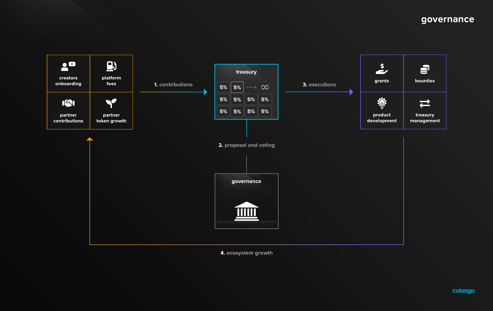

# Governance

CBG can also be seen as a Governance Token as it gives the right for token holders to vote on the decisions of the DAO, as well as make Signal and Core Proposals.

Keep in mind that the governance will be implemented gradually and in phases. In the beginning, all decisions will be made by the founders of cobogo social, then they will be handled by the community.

1 CBG equals to 1 vote, so the more CBG the holder has, the more power over the DAO they will have. This includes power over the Treasury and the future of developments and integrations.

Holders will able to make “Signal Proposals”, that is, a proposal that anyone can post in the community, with non-binding votes, and “Core Proposals”, which are put forward by councils, with options based on Signal Proposals, and binding votes. This feature will be implemented gradually. More details can be read [here](../../dao/governance.md).
