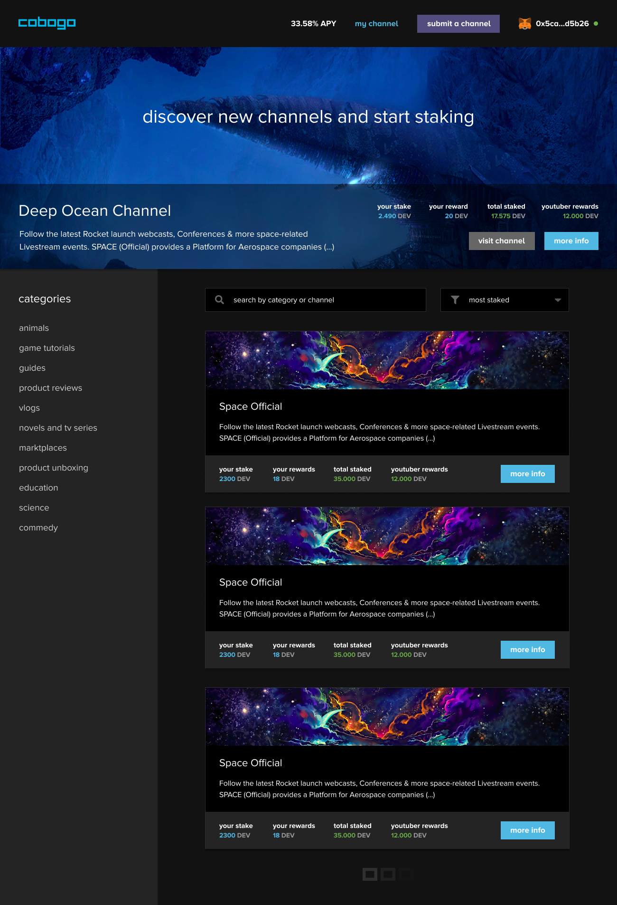
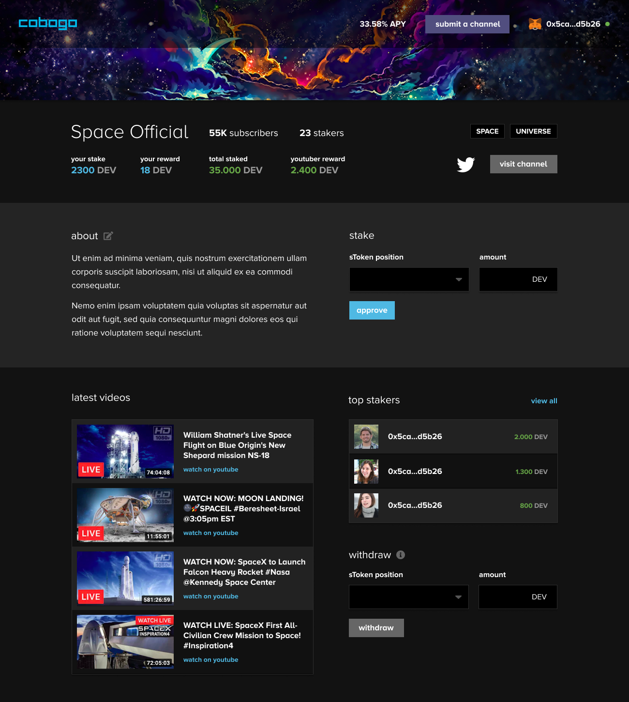

# Week 1 - 12/11/2021

Cobogo is our upcoming dApp where YouTube Creators will be able to create a pool for people to stake on. We want to keep our community constantly updated with each and every progress, so in this session, we will detail the activities which we have done in the week.

First, we have worked on the UI/UX of the onboarding pages Creators will have to go through in order to mint their pool.

&#x20;

We have also worked on the Homepage of our dApp.

In addition, we have created a Portuguese and Spanish version of our website [cobogo.social](https://cobogo.social).

For any questions or suggestions, feel free to reach out to us on our [Telegram](https://t.me/cobogosocial) group.
