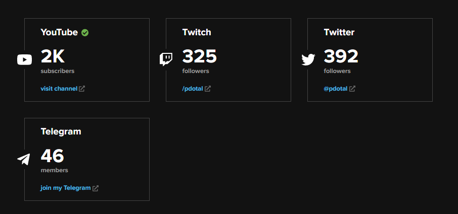

# Week 30 - 02/08/2022

You may notice that this week's updates took more than a week to be posted. That's because our weekly meetings with the whole team has been moved to Mondays (instead of Thursdays), so now the Weekly Updates will be posted on Tuesdays.

### Design

This week we have worked on the design for the Initial Page for the Creator Profiles. This page will display every Creator that has made a profile, and brands will be able to use filters to help them find the ideal Creator for their campaign.

Here's how it's looking so far:

.png>)

### Development

We have worked on fixing some bugs related to the Creator Profiles, and we have added Twitch as a Social Media option.&#x20;

### Medium

Since we are moving towards the Media Market, where cobogo will match Creators with brands to collaborate together, we have just posted an article with tips on how to choose the best Content Creators for a marketing campaign.

You can check the article [here](https://medium.com/@cobogosocial/how-to-choose-creators-for-your-campaign-50da65a1dfeb).

### Grants

We have started applying for Grants again, so we can have more funds to continue developing the project.

