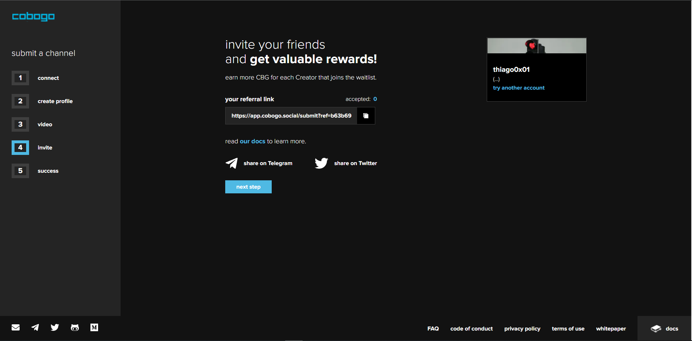

# Referral Program

As described in [this](../tokenomics/bounties.md) page, we have a Referral Program called "Bounties".&#x20;

On the first phase of the program, which will start in March, 2022, the Creators entering the [wait list](getting-started.md) will be able to invite their friends to join the platform on step 4 of the onboarding process.

All they will have to do is copy their unique referral link and share to as many people as they can, telling their friends to enter the wait list, and preferably join our [Discord](https://discord.gg/p3xScxHz).&#x20;

If the referred friend actually submits their channel to enter the wait list (see the [Getting Started](getting-started.md)), using the Creator's unique link, he will get 100 CBG as a reward, and the Creator who referred him will get 50 CBG as commission.

2,500,000 CBG will be destined for these rewards, so this first phase of bounties will go as long as there are CBG tokens left.

These bounties will work as way to encourage the cobogo community's growth and distribute CBG tokens to those who help do it, so come and be part of our story!

